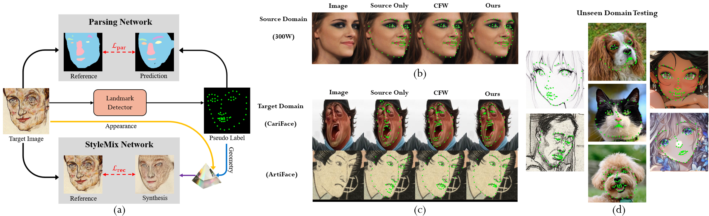
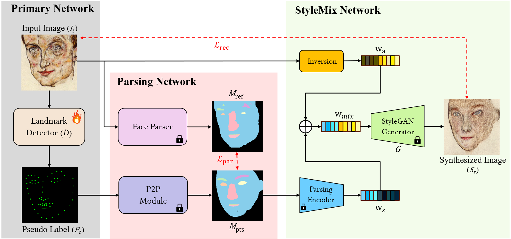

# PriSM: Parsing and Style-Mixed Consistency for Unsupervised Domain Adaptation in Facial Landmark Detection (ECCV 2026)

### [Paper] 

**Chieh-Yu Yang¹**, **Hou-Ning Hu²**, **Sykai Chen²**, **Yu-Lun Liu¹**, and **Yen-Yu Lin¹**  
¹ *National Yang Ming Chiao Tung University (NYCU), Hsinchu, Taiwan*  
² *MediaTek, Hsinchu, Taiwan*  

---

## Teaser
 

---

## Abstract
Facial landmark detectors trained on real human faces often fail to generalize effectively to stylized domains such as caricatures and artistic portraits, necessitating unsupervised domain adaptation (UDA). Although self-training is a widely used UDA strategy to bridge domain gaps, it frequently breaks down under large domain shifts as it is prone to amplifying confident yet erroneous pseudo-label predictions. To this end, we propose **PriSM (Parsing and Style-Mixed Consistency)**, a novel method for robust landmark pseudo-label validation. PriSM leverages two complementary signals: a **Parsing Network** enforces high-level structural alignment through face parsing consistency, while a **StyleMix Network** enforces fine-grained geometric constraints by reducing the reconstruction error between the input face and another face synthesized from the pseudo-label’s structure and the input face’s appearance. Extensive experiments on the challenging CariFace and ArtiFace benchmarks under the UDA setting demonstrate that PriSM significantly outperforms existing state-of-the-art methods and exhibits strong generalizability to unseen domains.

---

## Overview


---

## Directory Structure
To run our code, please organize your workspace as follows:

```text
PriSM-UDA/
├── configs/                      # Configuration files for the baseline landmark detector
├── data/                         # Dataloader scripts
├── Landmark2/                    # Source code for the baseline SLPT landmark alignment network
├── models/                       # PriSM model modules (PSP, Segmentation)
├── preprocess/                   # Isolated preprocessing scripts
│   ├── face_parsing/             (Face parsing extraction tool)
│   └── GAN_inversion/            (StyleGAN latent inversion tool)
├── Dataset/                      # Place your datasets here
│   ├── 300W/
│   ├── CariFace_dataset/
│   └── AF_dataset/
├── pretrained_models/            # Directory containing all pretrained model weights
├── train.py                      # Main training script
└── test.py                       # Evaluation and visualization script
```

---

## Data Preparation

We conduct experiments on three facial landmark datasets: **300W** (Source domain), **CariFace** (Target domain 1), and **ArtiFace** (Target domain 2).

Please download the datasets and structure your `./Dataset` directory as follows:

```text
Dataset/
├── 300W/                         # Source Domain (Real Human Faces)
│   ├── images/
│   ├── landmarks/
│   ├── train_list.txt
│   └── test_list.txt
│
├── CariFace_dataset/             # Target Domain 1 (Caricatures)
│   ├── images/
│   ├── landmarks/
│   ├── parsing/                  # Precomputed reference parsing maps
│   ├── output_batch/             # Precomputed StyleGAN latent codes (.pt)
│   ├── train_list.txt
│   └── test_list.txt
│
└── AF_dataset/                   # Target Domain 2 (Artistic Portraits)
    ├── images/
    ├── landmarks/
    ├── parsing/                  # Precomputed reference parsing maps
    ├── output_batch/             # Precomputed StyleGAN latent codes (.pt)
    ├── train_list.txt
    └── test_list.txt
```

---

## Pretrained Models
Please download all the necessary pretrained weights from our [Google Drive Link](https://drive.google.com/drive/folders/1iqm419Iha1NL-6DGpUU1VvcEt4ZwrcHP?usp=sharing) and place them inside the `pretrained_models/` directory:

| Filename | Description | Original Source / Credit |
| :--- | :--- | :--- |
| `model_best.pth` | Baseline source landmark detector (SLPT) pretrained on 300W. Used as initial weights for our landmark alignment network. | [SLPT (Xia et al., CVPR 2022)](https://github.com/Jiahao-UTS/SLPT-master) |
| `landmark_segmentation_model2_50.pth` | Landmark segmentation network. Serves as our Point-to-Parse (P2P) module. | Ours (PriSM, This work) |
| `styleganex_mask2face.pt` | StyleGANEX (pSp) facial style-mixing model. Used as the StyleMix Network for target image reconstruction. | [StyleGANEX (Yang et al., ICCV 2023)](https://github.com/williamyang1991/StyleGANEX) |
| `styleganex_inversion.pt` | StyleGANEX inversion optimization model. Used in `preprocess/GAN_inversion` for image latent optimization. | [StyleGANEX (Yang et al., ICCV 2023)](https://github.com/williamyang1991/StyleGANEX) |
| `38_G.pth` | Face parsing generator (EHANet). Used in `preprocess/face_parsing` to extract reference parsing maps ($M_{\text{ref}}$). | Architecture: [EHANet (Luo et al., 2020)](https://github.com/JACKYLUO1991/FaceParsing) / Weights: [TracelessLe](https://github.com/TracelessLe/FaceParsing.PyTorch) |
| `UDA_Cariface.pt` | Our final adapted landmark alignment network checkpoint on the CariFace benchmark. | Ours (PriSM, This work) |
| `UDA_Artiface.pt` | Our final adapted landmark alignment network checkpoint on the ArtiFace benchmark. | Ours (PriSM, This work) |

---

## Data Preprocessing (Optional)

> 💡 **Note for Direct Download**:
> If you download our precomputed files from Google Drive, you **do not** need to run these preprocessing steps. Simply extract and place the downloaded `parsing/` and `output_batch/` folders directly into `Dataset/CariFace_dataset/` and `Dataset/AF_dataset/` respectively (as illustrated in the **Data Preparation** section above).

If you want to run PriSM on your own **custom stylized dataset**, you can extract these necessary representations using our isolated tools in `preprocess/`:

### 1. Extract Reference Face Parsing Maps ($M_{\text{ref}}$)
Run `extract_parsing.py` to generate semantic parsing PNGs using the pre-trained EHANet face parser:
```bash
cd preprocess/face_parsing
python extract_parsing.py --arch FaceParseNet101 \
                          --weight_path ../../pretrained_models/38_G.pth \
                          --input_dir ../../Dataset/YOUR_DATASET/images \
                          --output_dir ../../Dataset/YOUR_DATASET/parsing
cd ../..
```

### 2. Extract StyleGAN Latent Codes ($w_a$)
Run `inversion_whole.py` to execute latent optimization and save latent representations (`.pt` files containing $w^+$) for each image:
```bash
cd preprocess/GAN_inversion
python inversion_whole.py --input_dir ../../Dataset/YOUR_DATASET/images \
                          --output_dir ../../Dataset/YOUR_DATASET/output_batch \
                          --ckpt ../../pretrained_models/styleganex_inversion.pt
cd ../..
```

---

## Training

To train the landmark alignment network using our joint optimization strategy (Source Supervised Loss + Target PriSM Consistency Loss), run:

```bash
python train.py --gpu_id 0 --batch_size 5 --epoch 300 --tgt_data Dataset/AF_dataset
```

* *Model snapshots will be saved automatically in `./snapshots/`.*
* *Pseudo-labels generated during training will be saved in `./pseudo_data/`.*

---

## Evaluation and Visualization

We provide an automated evaluation pipeline that computes Normalized Mean Error (NME), Failure Rate (FR @0.08), and Area Under Curve (AUC @0.08) across **300W**, **CariFace**, and **ArtiFace**.

> 💡 **Quick Reproducibility**:
> You can directly download our best adapted model weights (`UDA_Cariface.pt` and `UDA_Artiface.pt`) from our [Google Drive Link](https://drive.google.com/drive/folders/1iqm419Iha1NL-6DGpUU1VvcEt4ZwrcHP?usp=sharing), place them in `pretrained_models/`, and run the scripts below to immediately reproduce the quantitative results reported in our paper.

### 1. Full Evaluation and Save Visualizations (Default)
To evaluate your checkpoint on all three benchmarks and save visualizations with landmark overlays:
```bash
python test.py --checkpoint pretrained_models/UDA_Artiface.pt --gpu_id 0
```
*Visualizations will be cleanly organized and saved in `./visualizations/300W/`, `./visualizations/CariFace/`, and `./visualizations/ArtiFace/` respectively.*

### 2. Evaluate Specific Benchmark Without Visualizations
If you want to disable visualization output and test on specific datasets only:
```bash
# Evaluate only on ArtiFace without saving image outputs
python test.py --checkpoint pretrained_models/UDA_Artiface.pt --no_300w --no_cariface --no_visuals
```

---

## Citation
If you find PriSM useful for your research, please cite our paper:

```bibtex
@inproceedings{yang2026prism,
  title     = {PriSM: Parsing and Style-Mixed Consistency for Unsupervised Domain Adaptation in Facial Landmark Detection},
  author    = {Yang, Chieh-Yu and Hu, Hou-Ning and Chen, Sykai and Liu, Yu-Lun and Lin, Yen-Yu},
  booktitle = {European Conference on Computer Vision (ECCV)},
  year      = {2026}
}
```

---

## Acknowledgements

This codebase is heavily built upon [CFW (Generalizable Face Landmarking)](https://github.com/Dixin-Lab/generalized-face-landmarker). We also extend our sincere gratitude to the authors of [SLPT](https://github.com/njustslat/SLPT), [StyleGANEX](https://github.com/sczhou/StyleGANEX), and [EHANet](https://github.com/E-H-A-Net) for releasing their valuable codebases to the research community.
